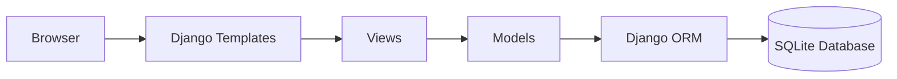
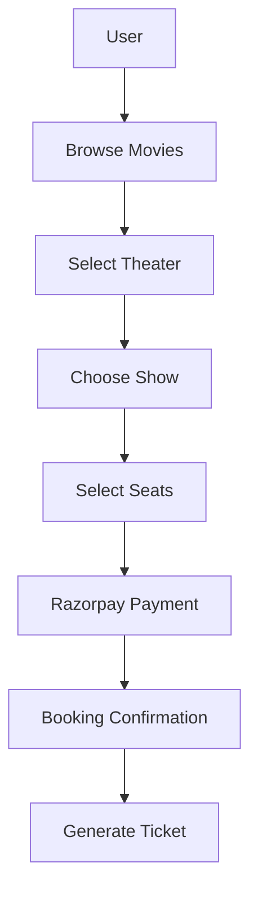
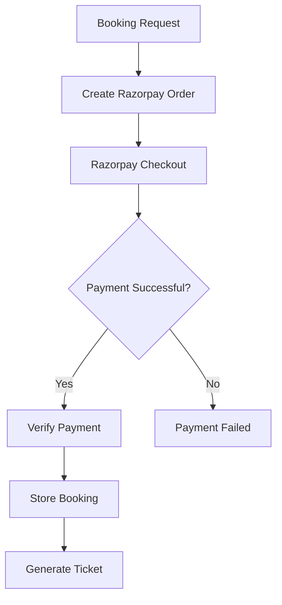

# 🎬 Movie Ticket Booking Platform


A production-inspired Django web application for managing movie ticket reservations, theater scheduling, seat allocation, user authentication, and online payments.

The project demonstrates how a real-world ticket booking platform can be structured using Django's modular architecture, separating authentication, booking, movie management, and payment workflows into independent components.

---

## ✨ Features

- User Registration & Authentication
- Browse Movies & Show Details
- Theater & Show Management
- Seat Selection & Booking
- Razorpay Payment Integration
- Booking Confirmation
- Booking History
- Email Notifications
- Django Admin Dashboard
- Responsive User Interface

---

# 🏗️ System Architecture



---

# 🔄 Booking Workflow



---

# 💳 Payment Flow



---

## 📂 Project Structure

```text
bookmyshow-clone/
│
├── movies/
├── bookings/
├── users/
├── templates/
├── static/
├── media/
├── project/
│
├── manage.py
├── requirements.txt
├── README.md
└── .env
```

---

## 🛠️ Technology Stack

| Category | Technology |
|----------|------------|
| Language | Python 3.11 |
| Framework | Django |
| Database | SQLite |
| ORM | Django ORM |
| Frontend | HTML5, CSS3, Bootstrap, JavaScript |
| Payment | Razorpay |
| Image Processing | Pillow |
| Version Control | Git & GitHub |

---

## 🗄️ Database Design

Core entities include:

- Users
- Movies
- Theaters
- Screens
- Shows
- Seats
- Bookings
- Payments

The application uses Django ORM with normalized relational database design to manage relationships between these entities.

---

## 🚀 Getting Started

### Clone the repository

```bash
git clone https://github.com/your-username/bookmyshow-clone.git
cd bookmyshow-clone
```

### Create a virtual environment

```bash
python -m venv .venv
```

### Activate virtual environment

**Windows**

```bash
.venv\Scripts\activate
```

**Linux/macOS**

```bash
source .venv/bin/activate
```

### Install dependencies

```bash
pip install -r requirements.txt
```

### Apply migrations

```bash
python manage.py migrate
```

### Create an admin account

```bash
python manage.py createsuperuser
```

### Run the development server

```bash
python manage.py runserver
```

Visit:

```
http://127.0.0.1:8000
```

Admin Panel:

```
http://127.0.0.1:8000/admin
```

---

## 📸 Screenshots

> Screenshots will be added after deployment.

```
screenshots/
├── home.png
├── movie-details.png
├── booking.png
└── admin-dashboard.png
```

---

## 🔮 Future Improvements

- PostgreSQL Support
- Docker Containerization
- Redis Caching
- Celery Background Tasks
- Email Queue
- Booking Expiration
- Seat Locking Mechanism
- JWT Authentication
- REST API
- React Frontend
- GitHub Actions CI/CD
- Production Deployment
- AI Movie Recommendation System
- AI Booking Assistant

---

## 💡 Learning Objectives

This project was built to strengthen backend engineering concepts including:

- Django Project Structure
- Authentication & Authorization
- Relational Database Design
- Django ORM
- Payment Gateway Integration
- Session Management
- Booking Workflow Design
- Admin Dashboard Management
- Modular Backend Architecture
- Production-Oriented Development

---

## 🤝 Contributing

Contributions, suggestions, and improvements are welcome.

Feel free to fork the repository, create a feature branch, and submit a pull request.

---

## 📄 License

This project is intended for educational and portfolio purposes.

MIT License.

---

## 👨‍💻 Author

**Jay Prajapati**

GitHub: https://github.com/JAY-822005

LinkedIn: https://www.linkedin.com/in/jay-prajapati-760177311/
